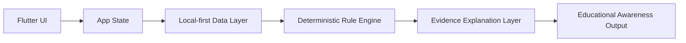

# ParkinSUM Companion

[](https://github.com/albertzhzhou-droid/ParkinSUM/actions/workflows/ci.yml)

ParkinSUM Companion is a local-first Flutter prototype for Parkinson's disease diet-medication education, combining meal logging, medication context, deterministic food-drug interaction rules, and evidence-oriented explanations without sending sensitive data to the cloud.

It is a production-architecture prototype designed for educational demonstrations, software architecture review, and academic discussion of local-first digital health prototypes. It is not a medical device and must not be used for diagnosis, treatment, medication timing, dietary guidance, clinical decision-making, patient care, or emergency support.

Public demos should use synthetic or sample data only.

## What It Demonstrates

- Meal logging and medication-context capture for a Parkinson's disease education scenario.
- Deterministic food-drug interaction checks instead of black-box medical advice.
- Evidence-oriented explanations that show why a prototype rule fired.
- Local-first app behavior for public demos and development.
- Optional Firebase-backed paths for internal operator validation and governance.
- Public-release guardrails around disclaimers, security, contribution rules, and synthetic data.

## Algorithm and Safety Boundary

ParkinSUM's conflict engine is **deterministic and evidence-linked**: no LLM
sits inside it, and every educational rule that fires carries a structured
explanation with source references, provenance, the input fields actually
used, any missing or uncertain inputs, an explicit limitation, and a hard
not-advice boundary.

Medication context must be **catalog-backed and unit-explicit** before any
food-medication rule is evaluated. A bare numeric dose such as `100`, an
unstructured string such as `"100 tablets"`, or a name without a unit such as
`levodopa 100` is rejected outright — ParkinSUM does not infer mg, tablet
count, schedule, formulation, or release type from such input. Entries
without an active ingredient, drug product variant, formulation, or
provenance are treated as insufficient context and do not produce a conflict
result.

High-value contributor work in this area includes:

- Medication context validation (`lib/domain/usecases/medication_entry_validator.dart`).
- Evidence-linked rule explanations (`lib/domain/entities/rule_explanation.dart`).
- Importer provenance fields (basis, scope, jurisdiction, confidence, source).
- Negative safety tests that prevent educational copy from drifting into
  medication timing, dose, dietary, or clinical-validation claims
  (`test/medication_entry_validator_test.dart`,
  `test/rule_explanation_safety_test.dart`).

See [docs/RULE_ENGINE.md](docs/RULE_ENGINE.md) for the medication context
gate, the structured rule-explanation template, a worked levodopa+protein
example, and the negative-test expectations.

## Mechanistic Conflict and Recommendation Engine

ParkinSUM now includes a deterministic, time-axis, literature-informed
**educational conflict engine** that models meal composition, gastric
emptying assumptions, small-intestinal arrival, a levodopa absorption
opportunity window, an amino-acid competition proxy, overlapping-meal
effects, and uncertainty bands. Every modeled assumption is backed by a
local source registry (`lib/domain/usecases/model_assumption_registry.dart`)
that cites entries in [Bibliographies.md](Bibliographies.md) (MLA format).

The next-meal recommendation engine accepts a **user-defined time window**
and a regional food library, then ranks candidate foods inside that window
by modeled overlap with the educational simulation. **The engine does not
decide when the user eats**, does not produce medication timing or dietary
advice, and returns `insufficient_context` whenever the window or
medication context is missing.

The mechanistic engine is now the **primary ranker** for next-meal
recommendations whenever the request carries a user-defined time window
and the engine has at least `medium` confidence — see
`docs/CONFLICT_ENGINE_MODEL.md` for the promotion contract and the
`rankerUsed` field. Candidate scoring uses **deterministic multi-point
sampling** (5–12 samples, capped) across the user-provided window; the
worst-case overlap drives ranking and the best/average/per-sample summary
is surfaced for trace and UI. Gastric-emptying numerics live in a single
`GastricEmptyingParameterSet` with per-parameter `sourceRefs`, and the
amino-acid competition layer now applies a coarse, direction-only
**LNAA load factor** per protein source (animal vs plant). The runtime
food repository is augmented at app boot with foods projected from CDSS
observations so the scorer can rank real catalog-backed candidates, not
only synthetic replay items.

The data chain preserves fidelity end-to-end: missing nutrient data is
carried as **unknown, never coerced to a fake `0 g`** (`missingNutrientFields`
→ null components → lowered composition completeness → widened uncertainty);
actual USDA FDC **amino-acid fields** (verified nutrient-number mapping) feed
the LNAA layer in preference to the protein-source proxy; per-candidate
`CandidateMetadata` (authority, jurisdiction match, completeness, provenance)
is built from imported source data so official-in-jurisdiction outranks
synthetic/seed. The medication **dose is taken only from the user's entered
dosage note** (value + unit must both be explicit) — there is no private
default; a missing/ambiguous dose yields insufficient context and blocks
dose-dependent interpretation. The conflict engine evaluates **each levodopa
dose** on a multi-dose time axis and aggregates with deterministic
max-overlap, keeping per-dose traces.

Compact mechanistic-trace UI cards render alongside the existing
recommendation and conflict-result views via an `ExpansionTile` so the
new surface stays out of the way until a reviewer expands it. Raw trace
JSON is never shown by default.

Synthetic replay scenarios are available via the CLI:

```sh
dart run tool/run_mechanistic_replay.dart
# or
npm run mechanistic:replay
```

The runner writes `build/mechanistic_replay/latest.{json,md}` and exits
non-zero on any expectation mismatch or banned-phrase hit.

See [docs/CONFLICT_ENGINE_MODEL.md](docs/CONFLICT_ENGINE_MODEL.md) for the
layered model description and [docs/REPLAY_RUNNER.md](docs/REPLAY_RUNNER.md)
for the scenario format and CLI details. ParkinSUM does not overclaim
clinical accuracy; the engine is an educational simulation, not a
patient-care tool.

## Educational Model Guardrails

The mechanistic conflict engine is **not clinically calibrated**. Its
gastric-emptying values are literature-informed prototype parameters; the
amino-acid (LNAA) competition layer is an educational proxy. It makes **no
patient-specific pharmacokinetic/pharmacodynamic prediction**, gives no
medication-timing, dietary, or dose guidance, and carries no clinical-validation
claim. All importer adapters are fixture-validated (not live production
ingestion); the optional live-source smoke harness is opt-in, excluded from
normal tests, fetches official metadata only, and is not used for clinical
advice. Source-specific legal/license review remains future work — see
[docs/SOURCE_ACCESS_AND_LICENSES.md](docs/SOURCE_ACCESS_AND_LICENSES.md).

## Multi-Jurisdiction Metadata & Protein Redistribution

ParkinSUM's importer layer is multi-jurisdiction: source-adapter specs cover
DailyMed (US), Health Canada DPD (CA), EMA + EU national registers (EU/EEA),
NHS dm+d (GB), PMDA (JP), NMPA (CN), and food-composition sources (USDA FDC,
Ciqual, China CDC), with a deterministic source-authority scorer
(official-in-jurisdiction outranks others; reference translations are
downgraded; seed/synthetic never overrides official; cross-jurisdiction
conflicts are preserved, not merged). Canonical source/provenance metadata —
jurisdiction, language, unit, basis, authority tier, completeness, limitation
— is preserved from importer to runtime so the mechanistic engine and scorer
can reason about it.

The next-meal scorer models **protein redistribution, not global protein
minimization**: protein is penalized only in modeled high-overlap windows and
allowed in low-overlap windows, with a non-clinical nutrition-adequacy proxy
so zero-protein does not automatically win. Window role is decided primarily
from modeled overlap, not the clock. The next-meal page lets the user provide
a meal-time *window*; mechanistic-primary ranking activates only with a
user-provided window and sufficient context.

See [docs/IMPORTER_METADATA_FLOW.md](docs/IMPORTER_METADATA_FLOW.md) for the
canonical metadata model, source-authority policy, cross-jurisdiction conflict
policy, completeness gate, and the protein-redistribution objective, and
[docs/MANUAL_VALIDATION.md](docs/MANUAL_VALIDATION.md) for a hands-on
walkthrough.

Fixture-tested medication source parsers now cover DailyMed, Health Canada
DPD, EMA, PMDA, **NHS dm+d** (identity/coding — not a complete food-effect
source), **EU national registers** (member-state identity vs full SmPC), and
**NMPA** (fixture-validated / prototype, honestly downgraded). A
`SourceFetchClient` abstraction (with an offline `FixtureSourceFetchClient`
returning structured `SourceFetchResult`s) keeps all tests deterministic;
live fetch is optional and never used for clinical advice. Per-food
amino-acid fields, when present, drive the LNAA competition layer in
preference to the protein-source proxy. The legacy heuristic can only order
results when `rankerEligibility.mechanisticPrimaryEligible == false`, with the
reason surfaced in UI + replay.

## Demo Media

The screenshots and GIF below use synthetic local demo data only. They show the current public prototype flow and are not medical advice, clinical validation, or patient data.


Capture requirements are tracked in [docs/media-capture-checklist.md](docs/media-capture-checklist.md), with asset-folder notes in [docs/assets/screenshots/README.md](docs/assets/screenshots/README.md) and [docs/assets/demo/README.md](docs/assets/demo/README.md).

## Quick Start

Install Flutter, Node.js, and npm first. Then run these commands from the repository root:

```sh
git clone https://github.com/albertzhzhou-droid/ParkinSUM.git
cd ParkinSUM
flutter pub get
flutter run -d chrome
```

Evaluate the prototype locally:

```sh
dart format --output=none --set-exit-if-changed .
flutter analyze
flutter test
npm ci
npm run public:preflight
npm run rules:contract
```

The default public-demo path is local mode. Firebase-backed commands are retained for internal operator validation and require project access.

## Alpha Release

The current public showcase target is `v0.1.0-alpha`. Release materials are tracked in [CHANGELOG.md](CHANGELOG.md), [docs/release/v0.1.0-alpha-notes.md](docs/release/v0.1.0-alpha-notes.md), [docs/release/synthetic-demo-data.md](docs/release/synthetic-demo-data.md), and [docs/release/release-checklist.md](docs/release/release-checklist.md).

Any Android APK generated for this alpha must be labeled as an alpha/demo/debug artifact unless production signing is handled in a separate release process.

## Project Website

A lightweight GitHub Pages landing page is available in [docs/site/index.html](docs/site/index.html). Setup instructions are in [docs/site/README.md](docs/site/README.md).

## Contribute

Start with the [contribution guide](CONTRIBUTING.md), then choose a scoped item from the [public contribution backlog](docs/contribution-backlog.md). Use the structured GitHub issue templates for bugs, features, documentation improvements, and research-rule evidence requests. A small real contributor PR request is drafted in [docs/mentor-pr-request.md](docs/mentor-pr-request.md) for classmates or mentors who want to test the project without making medical claims. Public examples must use synthetic or sample data only.

Secondary creators who need to fork the project, configure local GitHub authentication, and submit updates by pull request should follow the [secondary creator token flow](docs/secondary-creator-token-flow.md). The repository documents fork-scoped token permissions and setup steps, but never stores real token values.

## Architecture Overview



The app separates user-facing screens, app state, local data handling, deterministic rule evaluation, and evidence-oriented explanation copy. Firebase services are available for internal validation, but the public prototype should be evaluated with synthetic data and conservative claims.

See [docs/ARCHITECTURE.md](docs/ARCHITECTURE.md) and [docs/RULE_ENGINE.md](docs/RULE_ENGINE.md) for more detail.

## Safety Boundary

ParkinSUM Companion is an educational awareness prototype only.

- It does not diagnose, treat, monitor, prevent, or manage disease.
- It does not provide individualized dietary, medication, clinical, or emergency advice.
- It has no patient-outcome validation or clinical-use approval.
- It should not be connected to real health records for public demos.
- Screenshots, tests, walkthroughs, and examples should use synthetic or sample data only.

Read [DISCLAIMER.md](DISCLAIMER.md) and [docs/PUBLIC_DEMO_BOUNDARY.md](docs/PUBLIC_DEMO_BOUNDARY.md) before presenting or reusing the project.

## Repository Map

| Path | Purpose |
| --- | --- |
| `lib/app/` | Flutter app bootstrap and top-level app wiring. |
| `lib/features/` | User-facing flows such as dashboard, meals, medications, onboarding, import, and recommendations. |
| `lib/core/` | Shared models, state, services, database adapters, constants, i18n, and copy helpers. |
| `lib/domain/` | Entities, repositories, deterministic rule use cases, recommendation orchestration, and evidence-oriented runtime logic. |
| `lib/data/` | Local and remote data-source implementations, importers, and repository implementations. |
| `test/` | Focused Flutter and Dart tests for rule execution, importers, onboarding, Firebase boundaries, and recommendation copy. |
| `tool/` | Public preflight, Firebase governance, release, monitoring, and operator-validation scripts. |
| `docs/` | Architecture, rule-engine, release, public-boundary, risk, security-adjacent, and operations documentation. |

## Current Status

- Public release type: prototype showcase.
- Current public release target: `v0.1.0-alpha`.
- Package name: `parkinsum_companion`.
- Current app version: `0.1.0+1`.
- Default public-demo backend: local mode.
- Firebase backend mode: internal operator validation only.
- Public contact: `parkinsumservice@gmail.com`.
- Public readiness gate: `npm run public:preflight` should report zero `BLOCKER` findings before publication.

Public GitHub visibility does not claim external clinical, legal, privacy, regulatory, or patient-outcome approval.

## Roadmap

Near-term work is tracked in [ROADMAP.md](ROADMAP.md). Current priorities include:

- Capture clean synthetic-data screenshots and a short demo GIF.
- Keep the rule engine evidence-linked and auditable.
- Improve accessibility, localization, and caregiver-oriented educational flows.
- Expand sample-data walkthroughs without adding real patient data.
- Maintain release, security, and public-readiness checks as the prototype changes.

## Citation / Academic Use

ParkinSUM Companion may be cited as a software prototype or educational research artifact. Do not cite it as a clinical intervention, medical device, treatment system, or patient-outcome study.

Suggested citation format:

```text
Zhou, Z. ParkinSUM Companion: a local-first Flutter prototype for Parkinson's disease diet-medication education. GitHub repository, 2026. Available at: https://github.com/albertzhzhou-droid/ParkinSUM
```

If you discuss the project academically, include the safety boundary: educational awareness only, synthetic/demo data only, and no diagnosis, treatment, medication timing, dietary guidance, clinical decision-making, or patient-care use.

## Documentation

- [Disclaimer](DISCLAIMER.md)
- [Security policy](SECURITY.md)
- [Roadmap](ROADMAP.md)
- [Contribution guide](CONTRIBUTING.md)
- [Contribution backlog](docs/contribution-backlog.md)
- [Secondary creator token flow](docs/secondary-creator-token-flow.md)
- [Mentor/classmate PR request](docs/mentor-pr-request.md)
- [Changelog](CHANGELOG.md)
- [Citation metadata](CITATION.cff)
- [Repository metadata recommendations](docs/repository-metadata.md)
- [Social preview brief](docs/media/social-preview.md)
- [Rule engine testing](docs/rule-engine-testing.md)
- [Impact one-page summary](docs/impact/one-page-summary.md)
- [Impact technical case study](docs/impact/technical-case-study.md)
- [Impact project pitch](docs/impact/project-pitch.md)
- [Impact FAQ](docs/impact/faq.md)
- [Impact safety and ethics](docs/impact/safety-and-ethics.md)
- [v0.1.0-alpha release notes](docs/release/v0.1.0-alpha-notes.md)
- [Synthetic demo data](docs/release/synthetic-demo-data.md)
- [Synthetic demo scenarios](docs/demo-scenarios.md)
- [Release checklist](docs/release/release-checklist.md)
- [Project website](docs/site/index.html)
- [GitHub Pages setup](docs/site/README.md)
- [Public showcase readiness](PUBLIC_SHOWCASE_READINESS.md)
- [Public demo boundary](docs/PUBLIC_DEMO_BOUNDARY.md)
- [Architecture overview](docs/ARCHITECTURE.md)
- [Rule engine overview](docs/RULE_ENGINE.md)
- [Media capture checklist](docs/media-capture-checklist.md)
- [Release evidence index](docs/RELEASE_EVIDENCE_INDEX.md)
- [Known risks](docs/known_risks.md)

## Contributing

Contributions are welcome when they keep the public prototype boundary intact. Good first areas include documentation, UI strings, accessibility notes, synthetic sample interactions, and focused tests. Start with [CONTRIBUTING.md](CONTRIBUTING.md).

Do not submit personal health information, real medication schedules, credentials, service account keys, private Firebase exports, or raw operator logs.
