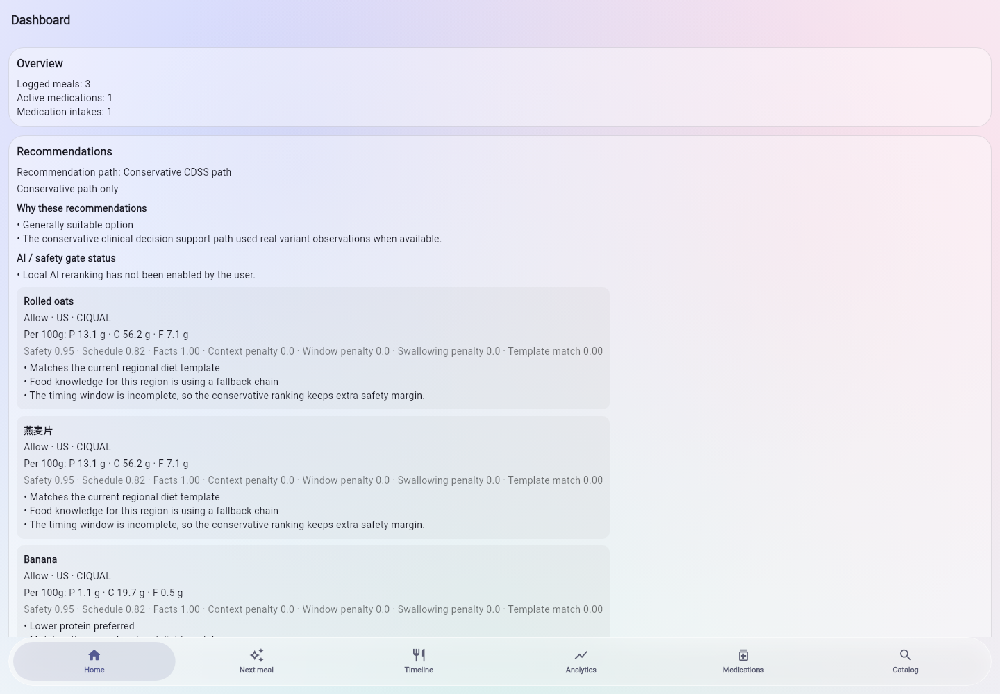
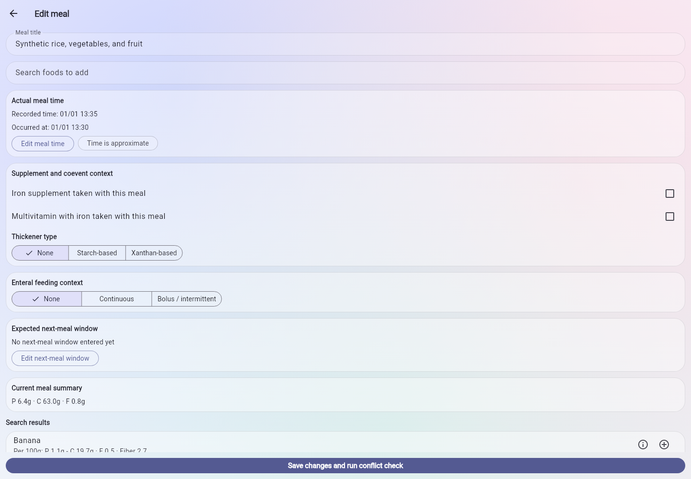
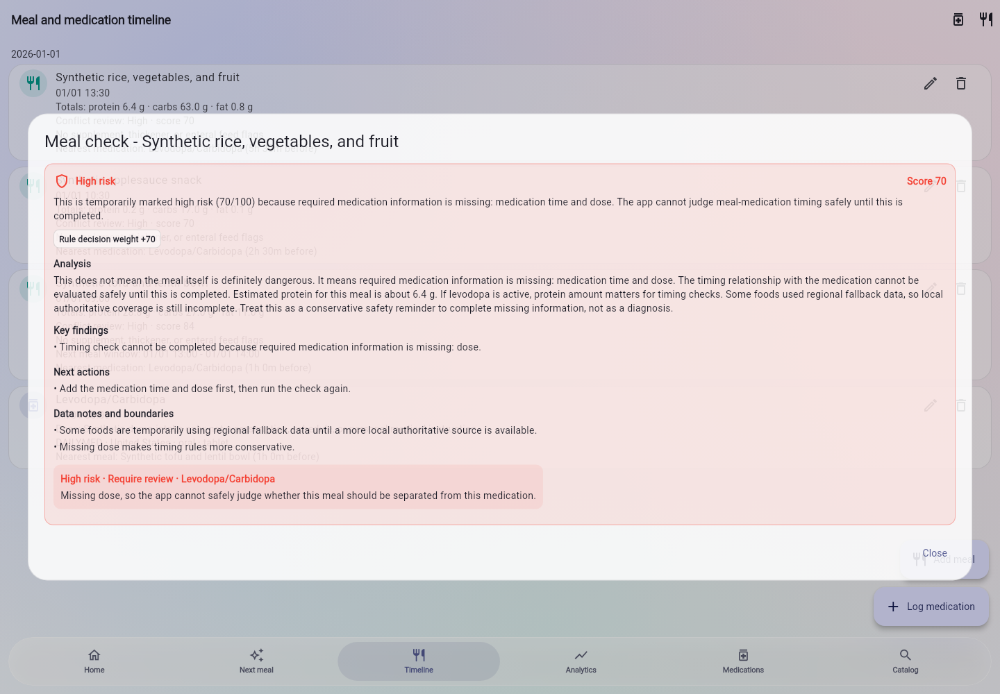
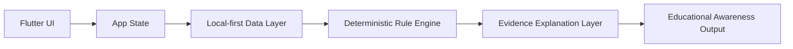

# ParkinSUM Companion

[](https://github.com/albertzhzhou-droid/ParkinSUM/actions/workflows/ci.yml)

ParkinSUM Companion is a local-first Flutter prototype for Parkinson's disease diet-medication education, combining meal logging, medication context, deterministic food-drug interaction rules, and evidence-oriented explanations without sending sensitive data to the cloud.

It is a production-architecture prototype designed for educational demonstrations, software architecture review, and academic discussion of local-first digital health prototypes. It is not a medical device and must not be used for diagnosis, treatment, medication timing, dietary guidance, clinical decision-making, patient care, or emergency support.

Public demos should use synthetic or sample data only.

## What It Demonstrates

- Meal logging and medication-context capture for a Parkinson's disease education scenario.
- Deterministic food-drug interaction checks instead of black-box medical advice.
- Evidence-oriented explanations that show why a prototype rule fired.
- Local-first app behavior for public demos and development.
- Optional Firebase-backed paths for internal operator validation and governance.
- Public-release guardrails around disclaimers, security, contribution rules, and synthetic data.

## Demo Media

The screenshots and GIF below use synthetic local demo data only. They show the current public prototype flow and are not medical advice, clinical validation, or patient data.








Capture requirements are tracked in [docs/media-capture-checklist.md](docs/media-capture-checklist.md), with asset-folder notes in [docs/assets/screenshots/README.md](docs/assets/screenshots/README.md) and [docs/assets/demo/README.md](docs/assets/demo/README.md).

## Quick Start

Install Flutter, Node.js, and npm first. Then run these commands from the repository root:

```sh
git clone https://github.com/albertzhzhou-droid/ParkinSUM.git
cd ParkinSUM
flutter pub get
flutter run -d chrome
```

Evaluate the prototype locally:

```sh
dart format --output=none --set-exit-if-changed .
flutter analyze
flutter test
npm ci
npm run public:preflight
npm run rules:contract
```

The default public-demo path is local mode. Firebase-backed commands are retained for internal operator validation and require project access.

## Alpha Release

The current public showcase target is `v0.1.0-alpha`. Release materials are tracked in [CHANGELOG.md](CHANGELOG.md), [docs/release/v0.1.0-alpha-notes.md](docs/release/v0.1.0-alpha-notes.md), [docs/release/synthetic-demo-data.md](docs/release/synthetic-demo-data.md), and [docs/release/release-checklist.md](docs/release/release-checklist.md).

Any Android APK generated for this alpha must be labeled as an alpha/demo/debug artifact unless production signing is handled in a separate release process.

## Project Website

A lightweight GitHub Pages landing page is available in [docs/site/index.html](docs/site/index.html). Setup instructions are in [docs/site/README.md](docs/site/README.md).

## Contribute

Start with the [contribution guide](CONTRIBUTING.md), then choose a scoped item from the [public contribution backlog](docs/contribution-backlog.md). Use the structured GitHub issue templates for bugs, features, documentation improvements, and research-rule evidence requests. A small real contributor PR request is drafted in [docs/mentor-pr-request.md](docs/mentor-pr-request.md) for classmates or mentors who want to test the project without making medical claims. Public examples must use synthetic or sample data only.

## Architecture Overview



The app separates user-facing screens, app state, local data handling, deterministic rule evaluation, and evidence-oriented explanation copy. Firebase services are available for internal validation, but the public prototype should be evaluated with synthetic data and conservative claims.

See [docs/ARCHITECTURE.md](docs/ARCHITECTURE.md) and [docs/RULE_ENGINE.md](docs/RULE_ENGINE.md) for more detail.

## Safety Boundary

ParkinSUM Companion is an educational awareness prototype only.

- It does not diagnose, treat, monitor, prevent, or manage disease.
- It does not provide individualized dietary, medication, clinical, or emergency advice.
- It has no patient-outcome validation or clinical-use approval.
- It should not be connected to real health records for public demos.
- Screenshots, tests, walkthroughs, and examples should use synthetic or sample data only.

Read [DISCLAIMER.md](DISCLAIMER.md) and [docs/PUBLIC_DEMO_BOUNDARY.md](docs/PUBLIC_DEMO_BOUNDARY.md) before presenting or reusing the project.

## Repository Map

| Path | Purpose |
| --- | --- |
| `lib/app/` | Flutter app bootstrap and top-level app wiring. |
| `lib/features/` | User-facing flows such as dashboard, meals, medications, onboarding, import, and recommendations. |
| `lib/core/` | Shared models, state, services, database adapters, constants, i18n, and copy helpers. |
| `lib/domain/` | Entities, repositories, deterministic rule use cases, recommendation orchestration, and evidence-oriented runtime logic. |
| `lib/data/` | Local and remote data-source implementations, importers, and repository implementations. |
| `test/` | Focused Flutter and Dart tests for rule execution, importers, onboarding, Firebase boundaries, and recommendation copy. |
| `tool/` | Public preflight, Firebase governance, release, monitoring, and operator-validation scripts. |
| `docs/` | Architecture, rule-engine, release, public-boundary, risk, security-adjacent, and operations documentation. |

## Current Status

- Public release type: prototype showcase.
- Current public release target: `v0.1.0-alpha`.
- Package name: `parkinsum_companion`.
- Current app version: `0.1.0+1`.
- Default public-demo backend: local mode.
- Firebase backend mode: internal operator validation only.
- Public contact: `parkinsumservice@gmail.com`.
- Public readiness gate: `npm run public:preflight` should report zero `BLOCKER` findings before publication.

Public GitHub visibility does not claim external clinical, legal, privacy, regulatory, or patient-outcome approval.

## Roadmap

Near-term work is tracked in [ROADMAP.md](ROADMAP.md). Current priorities include:

- Capture clean synthetic-data screenshots and a short demo GIF.
- Keep the rule engine evidence-linked and auditable.
- Improve accessibility, localization, and caregiver-oriented educational flows.
- Expand sample-data walkthroughs without adding real patient data.
- Maintain release, security, and public-readiness checks as the prototype changes.

## Citation / Academic Use

ParkinSUM Companion may be cited as a software prototype or educational research artifact. Do not cite it as a clinical intervention, medical device, treatment system, or patient-outcome study.

Suggested citation format:

```text
Zhou, Z. ParkinSUM Companion: a local-first Flutter prototype for Parkinson's disease diet-medication education. GitHub repository, 2026. Available at: https://github.com/albertzhzhou-droid/ParkinSUM
```

If you discuss the project academically, include the safety boundary: educational awareness only, synthetic/demo data only, and no diagnosis, treatment, medication timing, dietary guidance, clinical decision-making, or patient-care use.

## Documentation

- [Disclaimer](DISCLAIMER.md)
- [Security policy](SECURITY.md)
- [Roadmap](ROADMAP.md)
- [Contribution guide](CONTRIBUTING.md)
- [Contribution backlog](docs/contribution-backlog.md)
- [Mentor/classmate PR request](docs/mentor-pr-request.md)
- [Changelog](CHANGELOG.md)
- [Citation metadata](CITATION.cff)
- [Repository metadata recommendations](docs/repository-metadata.md)
- [Social preview brief](docs/media/social-preview.md)
- [Rule engine testing](docs/rule-engine-testing.md)
- [Impact one-page summary](docs/impact/one-page-summary.md)
- [Impact technical case study](docs/impact/technical-case-study.md)
- [Impact project pitch](docs/impact/project-pitch.md)
- [Impact FAQ](docs/impact/faq.md)
- [Impact safety and ethics](docs/impact/safety-and-ethics.md)
- [v0.1.0-alpha release notes](docs/release/v0.1.0-alpha-notes.md)
- [Synthetic demo data](docs/release/synthetic-demo-data.md)
- [Synthetic demo scenarios](docs/demo-scenarios.md)
- [Release checklist](docs/release/release-checklist.md)
- [Project website](docs/site/index.html)
- [GitHub Pages setup](docs/site/README.md)
- [Public showcase readiness](PUBLIC_SHOWCASE_READINESS.md)
- [Public demo boundary](docs/PUBLIC_DEMO_BOUNDARY.md)
- [Architecture overview](docs/ARCHITECTURE.md)
- [Rule engine overview](docs/RULE_ENGINE.md)
- [Media capture checklist](docs/media-capture-checklist.md)
- [Release evidence index](docs/RELEASE_EVIDENCE_INDEX.md)
- [Known risks](docs/known_risks.md)

## Contributing

Contributions are welcome when they keep the public prototype boundary intact. Good first areas include documentation, UI strings, accessibility notes, synthetic sample interactions, and focused tests. Start with [CONTRIBUTING.md](CONTRIBUTING.md).

Do not submit personal health information, real medication schedules, credentials, service account keys, private Firebase exports, or raw operator logs.
