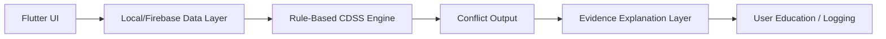

# ParkinSUM Companion

Local-first Flutter prototype for Parkinson's disease diet-medication education
and levodopa-food interaction awareness.

ParkinSUM Companion is a production-architecture prototype and educational
research project. It helps reviewers see how a Parkinson-focused companion app
could combine meal logging, medication context, deterministic rule checks,
evidence explanations, and privacy-aware data handling without presenting itself
as clinical software.

> Safety boundary: ParkinSUM is not a medical device and does not provide
> diagnosis, treatment, individualized dietary guidance, medication timing
> advice, patient care, or emergency support. Public demos must use synthetic or
> sample data only. See [DISCLAIMER.md](DISCLAIMER.md) and
> [PUBLIC_SHOWCASE_READINESS.md](PUBLIC_SHOWCASE_READINESS.md).

## Who It Is For

- Patients and caregivers in supervised educational demonstrations.
- Community health educators explaining diet-medication awareness concepts.
- Student researchers studying local-first digital health architecture.
- Flutter, Firebase, and open-source reviewers evaluating the prototype design.

## Why It Is Different

- Local-first default mode for public demos and development.
- Deterministic CDSS-style rule execution instead of black-box medical advice.
- Provenance-aware data ingestion and evidence references for explainable output.
- Privacy-aware Firebase governance for internal operator validation.
- Multilingual and accessibility direction for broader education use.
- Clear public boundary: synthetic data only, no clinical-use claims.

## What Works Now

- Onboarding with region, language, and prototype boundary surfaces.
- Meal logging and medication context flows.
- Rule-based meal-medication conflict checks.
- Explainable output with rule traces, severity, and evidence-oriented copy.
- Local data mode plus Firebase-backed internal validation paths.
- Importer, release, preflight, audit, monitoring, and rollback tooling.
- Public-safety documents for demo boundaries and contribution rules.

## Visual Showcase

Real screenshots and demo media should be captured from the current app build
before a public release. The expected asset slots are documented here:

- [Screenshot capture checklist](docs/assets/screenshots/README.md)
- [Demo media checklist](docs/assets/demo/README.md)

Target files:

- `docs/assets/screenshots/dashboard.png`
- `docs/assets/screenshots/meal-entry.png`
- `docs/assets/screenshots/conflict-result.png`
- `docs/assets/demo/parkinsum-demo.gif` or an external YouTube/Loom link

Do not add mock patient data, real health records, real medication schedules, or
credential-bearing operator logs to screenshots or videos.

## Architecture At A Glance



The app separates user-facing UI, data adapters, deterministic rule evaluation,
evidence-aware explanations, and operator governance. See
[docs/ARCHITECTURE.md](docs/ARCHITECTURE.md) and
[docs/RULE_ENGINE.md](docs/RULE_ENGINE.md).

## Quick Start

Clone the repository and run commands from the repository root. The examples
assume `flutter`, `dart`, `node`, and `npm` are available on `PATH`.

```sh
git clone https://github.com/albertzhzhou-droid/ParkinSUM.git
cd ParkinSUM
flutter pub get
flutter analyze
flutter test
```

Run the app in local mode:

```sh
flutter run -d chrome
```

Run the public repository preflight:

```sh
npm run public:preflight
```

Run Firebase rules contract validation:

```sh
node tool/firestore_rules_contract_check.mjs
```

## Project Status

- Public release type: prototype showcase.
- Package name: `parkinsum_companion`.
- Current app version: `1.0.0+1`.
- Default backend: local mode.
- Firebase backend mode: available for internal operator validation.
- Firebase projects in config: `parkinsum-companion-dev`,
  `parkinsum-companion-stage`, `parkinsum-companion`.
- Public contact: `parkinsumservice@gmail.com`.

Public GitHub visibility does not claim external clinical, legal, privacy, or
regulatory approval.

## Roadmap

Near-term work is tracked in [ROADMAP.md](ROADMAP.md). Priorities include an
evidence-linked rule registry, alpha APK release packaging, sample demo data,
accessibility improvements, caregiver-oriented onboarding, and offline education
booklet integration.

## Internal Firebase Operator Commands

Firebase-backed commands are retained to show the production-style governance
architecture. They require project access and must not be used with real user
health data in public demos.

Run the app against stage Firebase:

```sh
flutter run -d chrome --dart-define=PARKINSUM_BACKEND=firebase --dart-define=PARKINSUM_ENV=stage --dart-define=PARKINSUM_FIREBASE_PROJECT_ID=parkinsum-companion-stage
```

Build the Firebase-backed web artifact:

```sh
flutter build web --dart-define=PARKINSUM_BACKEND=firebase --dart-define=PARKINSUM_ENV=prod --dart-define=PARKINSUM_FIREBASE_PROJECT_ID=parkinsum-companion
```

Lightweight operator gates:

```sh
node tool/operator_gate.mjs --env stage --project parkinsum-companion-stage --release-id p1_stage_gate
node tool/operator_gate.mjs --env prod --project parkinsum-companion --read-only --release-id p1_prod_gate
```

## Documentation

- [Disclaimer](DISCLAIMER.md)
- [Public showcase readiness](PUBLIC_SHOWCASE_READINESS.md)
- [Security policy](SECURITY.md)
- [Contribution guide](CONTRIBUTING.md)
- [Roadmap](ROADMAP.md)
- [Architecture overview](docs/ARCHITECTURE.md)
- [Rule engine overview](docs/RULE_ENGINE.md)
- [v0.1.0-alpha release notes draft](docs/releases/v0.1.0-alpha.md)
- [Public demo boundary](docs/PUBLIC_DEMO_BOUNDARY.md)
- [Release evidence index](docs/RELEASE_EVIDENCE_INDEX.md)
- [Firebase production operations runbook](docs/firebase_operations_runbook.md)
- [Environment and deployment guide](docs/environment_deployment.md)
- [Rollback runbook](docs/rollback_runbook.md)
- [Known risks](docs/known_risks.md)

## Contributing

Contributions are welcome when they keep the public prototype boundary intact.
Good first areas include documentation, UI strings, accessibility notes, sample
synthetic interactions, and focused tests. Start with
[CONTRIBUTING.md](CONTRIBUTING.md).

## Public GitHub Preflight

The preflight scans the whole working tree, including local build artifacts, and
separates findings into:

- `BLOCKER`: must be fixed before publishing.
- `WARN`: usually acceptable local/generated evidence or internal operator
  references.
- `INFO`: positive readiness evidence.

Reports are written to:

- `build/public_release_preflight/latest.json`
- `build/public_release_preflight/latest.md`

Public showcase readiness requires zero `BLOCKER` findings.
