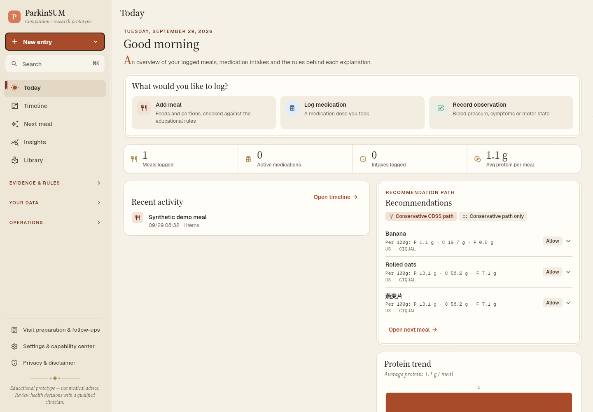
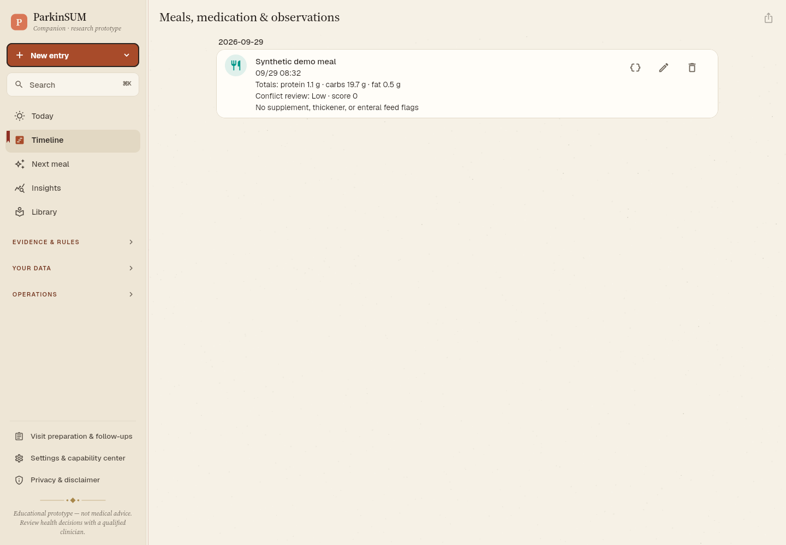
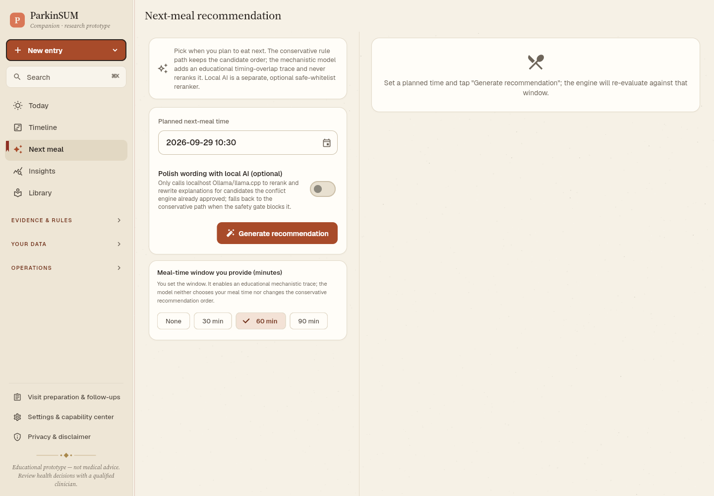
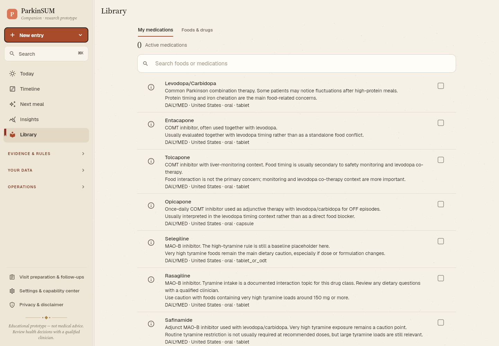
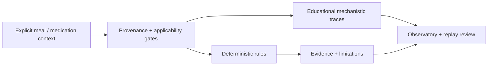

# ParkinSUM Companion

<p align="center">
  
</p>

[Brand assets: icon, logo & GitHub card](docs/media/social-preview.md)

[](https://github.com/albertzhzhou-droid/ParkinSUM/actions/workflows/ci.yml)


**A local-first research notebook for meal, medication, and evidence context.**

ParkinSUM combines a Flutter record-keeping interface with deterministic rule
explanations, an Algorithm Observatory, and reproducible synthetic research
tools. It makes assumptions, missing information, provenance, and model
limitations visible so reviewers can inspect how an educational result arose.

**Educational production-architecture prototype only. Not medical advice, not a
medical device, and not a clinical decision tool. The model is not clinically
calibrated. Public demonstrations use synthetic or sample data only.**

[Project showcase](https://albertzhzhou-droid.github.io/ParkinSUM/site/) ·
[Documentation](docs/README.md) ·
[Capabilities & limitations](docs/CAPABILITY_MATRIX.md) ·
[Verification guide](docs/PUBLIC_VERIFICATION.md) ·
[Changelog](CHANGELOG.md)

## September 2026 update

The latest development update brings the app, research tools, and public
showcase together around the **Paper** interface: warm paper tones, serif
headings, legible opaque surfaces, and restrained motion that respects reduced
motion settings. The app bundles Source Serif 4, Geist, and Geist Mono under
SIL OFL licenses; it does not download these fonts at runtime.

| Area | What changed | Evidence boundary |
| --- | --- | --- |
| **Paper workspace** | Five chapters, one entry composer, responsive navigation, and a shared command palette. | UI behavior is distinct from model or clinical validity. |
| **Algorithm Observatory** | Fixed synthetic scenarios, production-derived traces, configuration identities, explanation trees, and saved replay capsules. | Static contracts and executable trace coverage remain separately labeled. |
| **Medication and food context** | Explicit dose-unit handling, source and version provenance, missingness, and bounded food-rank sensitivity. | Unsupported context withholds interpretation; unknown data is not inferred. |
| **Owner-controlled records** | Observation entries, portable packages, recoverable history, and selected records for visit-preparation summaries. | Local records can contain sensitive information. Public demos must remain synthetic. |
| **Research workbench** | Synthetic rule testing, development-only FHIR/CQL/CDS Hooks experiments, and source/license review records. | Fixture agreement is scoped engineering evidence, not general standards conformance or clinical validation. |

The [iteration timeline](docs/APP_EVOLUTION_TIMELINE.md) records individual
changes, checks, unresolved boundaries, and rollback scopes. The
[capability matrix](docs/CAPABILITY_MATRIX.md) distinguishes implemented,
fixture-tested, report-only, and future work. This development update does not
create a new versioned release; package metadata remains `0.2.0+2`.

## The Paper workspace

| Chapter | What to explore |
| --- | --- |
| **Today** | A single composer for a meal, medication intake, or observation; recent activity and chapter previews. |
| **Timeline** | Logged entries, record details, editing, and explicit export actions. |
| **Next meal** | A user-defined time window, candidate comparison, and adjacent explanations and limitations. |
| **Insights** | Descriptive views of recorded entries, including logging rhythm and protein distribution. |
| **Library** | Selected medications and the food/medication catalog, with source context. |

Use **⌘K / Ctrl+K** or the sidebar groups to open the Algorithm Observatory,
rule audit trail, synthetic rule test workbench, data tools, and diagnostics.
Local AI settings live under **Settings → Advanced**. Research and operational
tools have their own destinations rather than competing with everyday records.

The [showcase](docs/site/index.html) presents the current interface. Screenshot
source, synthetic-state, and review boundaries are recorded in the
[media index](docs/assets/screenshots/README.md). A browser capture establishes
visible rendering at its recorded revision, not physical-device behavior,
workflow completion, accessibility conformance, or clinical accuracy.

## Current app screens

These 1440 × 1000 browser captures use a fresh local profile, one synthetic
banana meal, zero selected medications, and no AI consent. They were captured
on 2026-09-29 from the development worktree; they are not a final-commit binary
attestation. See the [capture record](docs/assets/screenshots/README.md).

<p align="center">
  
  <br><sub>Today: one entry composer, recent activity, descriptive figures, and the conservative candidate preview.</sub>
</p>

<table>
  <tr>
    <td width="50%"><br><sub>Timeline: the saved synthetic meal and its record controls.</sub></td>
    <td width="50%"><br><sub>Next meal: user-provided comparison settings before generating a result.</sub></td>
  </tr>
  <tr>
    <td colspan="2"><br><sub>Library: catalog source context with no medications selected; catalog text is not individualized guidance.</sub></td>
  </tr>
</table>

## Inspect the evidence

The conflict engine is **deterministic and evidence-linked**. Structured
explanations expose source references, the fields used, missing or uncertain
inputs, and limitations. No LLM sits inside the conflict engine.

- **Explicit context.** Medication interpretation requires supported,
  catalog-backed context and explicit units. Missing formulation, route,
  release type, dose evidence, or applicability cannot silently authorize a
  mechanistic curve. Missing nutrients remain unknown rather than becoming
  a fabricated `0 g`.
- **Trace-only mechanistic model.** Literature-informed gastric-residence,
  absorption-opportunity, amino-acid competition, and per-dose traces are
  educational sensitivity views. They do not select meal times or reorder
  candidate recommendations. The production decision-influence boundary is
  `trace_only`; outputs carry applicability and uncertainty limits.
- **Inspectible coverage.** The Observatory separates production-derived
  observations from static registry contracts. A declared algorithm descriptor
  does not establish executable trace coverage or complete verification.
- **Bounded optional AI.** With explicit consent, a loopback model may rerank
  only rule-screened, non-`BLOCK` candidates or polish existing copy. It cannot
  change medication data, conflict classifications, scores, rules, evidence,
  or safety gates.
- **Replayable research.** Synthetic cases, content-bound replay artifacts,
  source-quality reports, and independent contract checks support review.
  Passing a fixture proves only the checked assertion within its scope.

See the [rule-engine contract](docs/RULE_ENGINE.md),
[mechanistic model](docs/CONFLICT_ENGINE_MODEL.md),
[Observatory design](docs/design/ADR_ALGORITHM_OBSERVATORY.md), and
[synthetic rule workbench](docs/RULE_TEST_WORKBENCH.md).


```mermaid
flowchart LR
  Context["Explicit meal / medication context"] --> Gate["Provenance + applicability gates"]
  Gate --> Rules["Deterministic rules"]
  Rules --> Explain["Evidence + limitations"]
  Gate --> Model["Educational mechanistic traces"]
  Model --> Review["Observatory + replay review"]
  Explain --> Review
```

## Run locally

Use the Flutter version pinned in [CI](.github/workflows/ci.yml), a compatible
Dart SDK (`>=3.11.0 <4.0.0`), and Node.js/npm for repository checks.

```sh
git clone https://github.com/albertzhzhou-droid/ParkinSUM.git
cd ParkinSUM
flutter pub get
flutter run -d chrome --dart-define=PARKINSUM_BACKEND=local
```

Complete onboarding using a fresh synthetic profile. Open **Today** for the
workspace or **Algorithm Observatory** for fixed, non-personal scenarios.
Firebase-backed paths are retained for internal operator validation and require
separate project access; they are not needed for the local demo.

For the static showcase, serve the repository root and open `/docs/site/`:

```sh
python3 -m http.server 8000
```

## Verify a change

```sh
npm ci
dart format --output=none --set-exit-if-changed lib test tool
flutter analyze
flutter test
npm run public:preflight
npm run rules:contract
```

Inspect and run the broader synthetic governance checks as needed:

```sh
npm run verify:all -- --list
npm run verify:all
npm run mechanistic:replay
npm run source:quality
```

The [public verification guide](docs/PUBLIC_VERIFICATION.md) documents command
scope, prerequisites, expected outputs, and failure meaning. Generated reports
belong under ignored `build/` paths. A command listed here is a reproducible
entry point, not a claim that every check passed for every commit; use CI and
the dated timeline for actual results and open limitations.

## Safety, privacy, and research limits

ParkinSUM must not be used for diagnosis, treatment, medication timing, dose
selection, dietary guidance, clinical decision-making, patient care, or
emergency support. The educational model provides no patient-specific
pharmacokinetic/pharmacodynamic prediction or patient-outcome evidence.

Public screenshots, tests, examples, and walkthroughs must exclude real account
identifiers and health information. Owner-entered records and portable exports
can contain sensitive data; local storage and file digests do not establish
anonymity, encryption, or external authenticity. Do not publish personal exports,
credentials, raw operator logs, or real health records.

FHIR-inspired views, import previews, and development-only standards experiments
have separate, explicit scopes. Neither a local EvidenceTraceBundle nor a
passing synthetic differential establishes general FHIR/CQL/CDS Hooks
conformance. Source-adapter fixtures do not establish live production ingestion.
Open-source references remain subject to repository and asset-level license
review; a research reference is not permission to transfer its content.

Read the [disclaimer](DISCLAIMER.md), [public demo boundary](docs/PUBLIC_DEMO_BOUNDARY.md),
[source access policy](docs/SOURCE_ACCESS_AND_LICENSES.md), and
[security policy](SECURITY.md) before presenting or reusing the project.

## Documentation and contributions

| Entry point | Purpose |
| --- | --- |
| [Documentation index](docs/README.md) | Find app, research, evidence, and release documents. |
| [Evidence demo guide](docs/EVIDENCE_AND_TRACEABILITY_DEMO_GUIDE.md) | Review the synthetic evidence chain. |
| [Architecture](docs/ARCHITECTURE.md) | UI, state, local data, rules, and provenance layers. |
| [Bibliography](Bibliographies.md) | Sources behind educational assumptions. |
| [Contribution guide](CONTRIBUTING.md) | Scope a change and preserve public boundaries. |
| [Roadmap](ROADMAP.md) | Planned work and unresolved capabilities. |
| [Project wiki](https://albertzhzhou-droid.github.io/ParkinSUM/wiki/) | A short visual guide and reviewer route. |

Useful contributions improve source provenance, explicit missingness,
explanation clarity, synthetic regression cases, accessibility, localization,
and reproducibility. Start with a scoped item from the
[contribution backlog](docs/contribution-backlog.md); do not add medical claims
or treat unfinished research as a shipped capability.

## Repository map

| Path | Purpose |
| --- | --- |
| `lib/features/` | Paper chapters, evidence tools, record flows, and diagnostics. |
| `lib/core/` | Shared state, local storage, configuration, localization, and theme. |
| `lib/domain/` | Entities, deterministic rules, models, and evidence contracts. |
| `lib/data/` | Repository adapters, source importers, and persistence. |
| `config/` | Versioned governance, schema, source, and release inventories. |
| `test/` / `tool/` | Synthetic tests, replay runners, verification, and operator tools. |
| `docs/` | Public documentation, research boundaries, and iteration history. |

## Releases and contact

The versioned beta notes remain at
[v0.2.0-beta](docs/release/v0.2.0-beta-notes.md); subsequent development is
summarized in [CHANGELOG.md](CHANGELOG.md). See
[GitHub Releases](https://github.com/albertzhzhou-droid/ParkinSUM/releases) for
published artifacts rather than assuming the latest source update includes a
new binary. Android demo/debug artifacts do not establish production signing
or app-store readiness. The scoped
[npm package](packages/npm/README.md) contains release metadata.

Public contact: **parkinsumservice@gmail.com**.

For academic use, cite ParkinSUM as a software prototype or educational research
artifact, not as a clinical intervention, medical device, or patient-outcome
study. Public GitHub visibility is not clinical, legal, privacy, or regulatory
approval.
