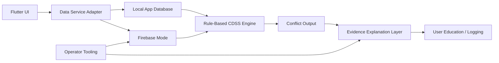

# Architecture Overview

ParkinSUM Companion is organized as a Flutter prototype with local-first demo
behavior, deterministic rule execution, provenance-aware data ingestion, and
Firebase-backed governance paths for internal operator validation.

## System Map

## App Layers

- Flutter UI covers onboarding, meal entry, medication context, timeline,
  import views, analytics, localization, and privacy/disclaimer surfaces.
- Domain use cases bridge app models into a unified runtime context for
  CDSS-style rule execution, recommendation replay, provenance projection, and
  meal interaction analysis.
- Data services support local mode for public demos and Firebase mode for
  internal validation.
- Importer tooling produces curated seed data with source and audit metadata.
- Operator tooling records release manifests, backup evidence, monitoring
  checks, audit summaries, live probes, and rollback records.

## Local Mode

Local mode is the default public-demo path. It supports development and
synthetic-data demonstrations without requiring users to connect to a production
backend. Public demos must not use real health information, real medication
schedules, symptoms, account tokens, Firebase credentials, service account keys,
user exports, or raw operator audit logs.

## Firebase Mode

Firebase-backed paths are retained to demonstrate production-style governance.
They are for internal operator validation, not public clinical use.

- `users/{uid}` records are private to the authenticated owner.
- Shared catalog rows are readable by signed-in users.
- Catalog writes are reserved for admin/importer operator identities.
- Rules are validated by `tool/firestore_rules_contract_check.mjs`.

## Rule Execution

The rule layer is deterministic. Meal, drug, timing, regional, and evidence
context is mapped into runtime inputs, evaluated against compiled rules, and
returned as explainable output. Optional AI copy-polish layers must never
replace the deterministic rule/audit core.

See [RULE_ENGINE.md](RULE_ENGINE.md) for rule trace, severity, and evidence
policy.

## Provenance And Importers

The importer path keeps source metadata attached to seed data and rule inputs.
The goal is to make educational output reviewable: a reviewer should be able to
see which source family or curated evidence entry shaped the result, rather than
treating the app as a black box.

## Safety Boundary

ParkinSUM is an educational and research prototype. It is not a medical device,
clinical workflow tool, diagnostic tool, or treatment system. Any future
real-world health or clinical use would require a separate intended-use
statement, professional clinical review, legal/privacy review, security review,
production-support ownership, and applicable regulatory analysis.

## Extension Points

- Backend adapter: local mode, Firebase mode, or future backend provider.
- Rule engine adapter: deterministic local rules or future external rules
  service.
- Evidence provider: curated seed today, future versioned evidence registry.
- Audit sink: local/operator audit today, future centralized logging.
- Explanation provider: conservative copy polishing that preserves rule output
  and safety boundaries.
