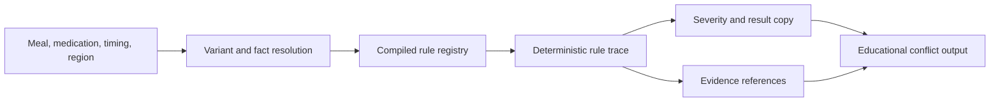

# Rule Engine Overview

ParkinSUM uses deterministic CDSS-style rule execution for educational software
architecture demonstration. The rule layer is designed to be explainable and
reviewable; it is not a substitute for professional medical advice.

## Design Goals

- Keep meal-medication checks deterministic and testable.
- Preserve source and provenance references where available.
- Return explainable output instead of opaque "AI advice."
- Keep optional language-polish layers separate from rule decisions.
- Use synthetic/sample data for public demos.

## Runtime Flow

## Rule Trace

A rule trace should make reviewer questions answerable:

- Which meal, medication, timing, and regional inputs were evaluated?
- Which compiled rule matched?
- Which facts, variants, or fallbacks affected the result?
- Which severity label was assigned?
- Which source references or evidence records were attached?
- Which user-facing explanation was produced?

## Severity Labels

Severity labels are prototype communication labels for educational output. They
must not be framed as clinical triage, diagnosis, treatment urgency, or
individualized medical advice.

Suggested documentation language:

- `low`: informational educational note.
- `moderate`: visible caution for reviewer attention in a demo.
- `high`: stronger prototype warning that still requires professional review
  and must not be treated as emergency or clinical instruction.

## Evidence References

Rules can carry source references and evidence-level metadata. Public docs
should describe this as provenance and reviewability, not as proof of clinical
validation. A future evidence registry should include source family, rule
version, effective dates, review status, and limitations.

## Why Not Black-Box Advice

ParkinSUM avoids black-box medical advice because the public prototype must be
reviewable, conservative, and bounded. Optional AI or copy-polish layers may
make wording easier to read, but they must not create, override, or hide the
deterministic rule result.

## Public Boundary

Use only synthetic or sample data. Do not use the rule engine for real diagnosis,
treatment, medication timing decisions, dietary decisions, patient care,
emergency decisions, or personal health management.

## Mechanistic Conflict Engine (Adjacent Layer)

A deterministic, time-axis, literature-informed *educational simulation* layer
sits alongside the declarative rule engine. It approximates gastric emptying,
small-intestinal arrival, levodopa absorption opportunity windows, amino-acid
competition pressure, and overlapping-meal effects. It is non-authoritative and
never overrides categorical rule-engine decisions.

See [CONFLICT_ENGINE_MODEL.md](CONFLICT_ENGINE_MODEL.md) for the layer-by-layer
description, gastric emptying assumptions, food-food interaction handling,
overlapping-meal handling, levodopa absorption assumptions, amino-acid
competition proxy, uncertainty/confidence scoring, explanation schema,
synthetic scenario fixtures, and what the model does *not* infer.

The mechanistic engine is consumed by:

- `NextMealRecommendationOrchestrator.recommend(...)` — attaches a
  `mechanisticTrace` (and per-candidate `mechanisticCandidateScores` when a
  user-defined window is provided) to `NextMealRecommendationResult`.
- `DatabaseBackedMealCheckUseCase.call(...)` — attaches a serialized trace to
  `InteractionResult.mechanisticTraceJson`.

See also [REPLAY_RUNNER.md](REPLAY_RUNNER.md) for the synthetic scenario suite
and the `dart run tool/run_mechanistic_replay.dart` CLI.

## Medication Context Gate

ParkinSUM does not infer medication dose or pharmacokinetic meaning from
free-text numbers. A numeric value without unit, active ingredient, product
variant, and formulation metadata is treated as incomplete context. Incomplete
medication context blocks food-medication rule evaluation. This design prevents
educational rule explanations from appearing more clinically precise than the
available input supports.

The gate is implemented in
`lib/domain/usecases/medication_entry_validator.dart`. It accepts a
`RawMedicationEntry` and returns a `MedicationContextValidationResult` with one
of three validity states:

- `valid` — every required field is present (active ingredient, drug product
  variant, strength, explicit unit, form, route, release type, jurisdiction,
  and source document id). Only this state produces a
  `NormalizedMedicationContext` and is eligible for rule evaluation.
- `insufficient` — structurally parseable but missing required catalog fields
  (e.g. no formulation, no route, no provenance). Returns a safe validation
  message; does not produce a conflict result.
- `invalid` — clearly unsupported input such as a bare number, "100 tablets",
  "one pill", "25/100" with no unit, or "levodopa 100" with no structured
  fields. The validator never tries to parse such inputs into structured dose
  fields.

### Rejected input examples

`100`, `100 tablets`, `one pill`, `25/100`, `25-100`, `levodopa 100`,
`Sinemet 100`, `100 mg` (no ingredient), `carbidopa/levodopa 25/100`
(no unit normalization).

### Required validation copy

When the gate rejects an entry, ParkinSUM returns copy similar to:

> Medication context is incomplete. ParkinSUM could not evaluate
> food-medication education rules for this entry. Please use a synthetic
> catalog-backed medication entry with ingredient, unit, formulation, and
> source metadata. This prototype does not provide medication dosing or
> timing advice.

## Structured Rule Explanation Template

When a rule fires, ParkinSUM emits a structured
`RuleExplanation` (`lib/domain/entities/rule_explanation.dart`) with the
following fields:

| Field | Purpose |
| --- | --- |
| `ruleId` | Stable identifier for the rule that fired. |
| `triggeredConditions` | Human-readable descriptors of which sub-conditions matched. |
| `inputFieldsUsed` | Runtime-context paths actually consumed by the rule. |
| `sourceRefs` | Source document references attached to the rule. |
| `provenanceSummary` | One-line summary of where authority comes from. |
| `evidenceStrength` | `label` / `mechanism` / `analogy` / `insufficient`. Documentation-level only; never a clinical evidence grade. |
| `limitationText` | Why the result cannot be treated as personal medical advice. |
| `missingOrUncertainInputs` | Inputs the rule could not evaluate (timing, formulation, etc.). |
| `safetyBoundary` | Hard safety boundary copy. |
| `notAdviceText` | Explicit not-advice disclaimer. |
| `outputType` | `educational_info` / `educational_caution` / `invalid_context`. |

The split between evidence/provenance fields and display copy is intentional:
tests verify each layer independently and assert that no banned prescriptive
phrase ever appears in any copy field.

### Worked example — levodopa + protein educational caution

| Field | Value |
| --- | --- |
| `ruleId` | `levodopa_protein_temporal_v1` |
| `triggeredConditions` | `drug.active_ingredients contains levodopa`, `meal.protein_band == moderate`, `timing.meal_to_drug within 0-60 min` |
| `inputFieldsUsed` | `drug.active_ingredients`, `drug.release_type`, `meal.protein_g`, `timestamps.drug_time`, `timestamps.meal_time` |
| `sourceRefs` | `synthetic:demo_label_carbidopa_levodopa#food_effect` |
| `evidenceStrength` | `label` |
| `limitationText` | Individual absorption varies. This prototype does not infer the patient's pharmacokinetics from the input. |
| `missingOrUncertainInputs` | `estimatedGastricEmptyingModifier` |
| `outputType` | `educational_caution` |

User-facing copy must remain non-prescriptive, for example:

> Protein-related educational flag triggered. This prototype explains a
> possible absorption-related mechanism using synthetic input and source-linked
> rule metadata. Individual effects vary. Do not change medication, diet, or
> timing based on this app.

It must never read like medication timing advice, dose-change advice, dietary
restriction advice, or a claim of clinical validation.

## Negative Test Expectations

The boundary is enforced in tests, not just docs. The following are required:

- A unitless numeric medication dose is rejected before rule evaluation.
- Invalid medication context produces safe validation copy, not a conflict
  result.
- A valid synthetic catalog-backed medication entry can still trigger an
  educational rule.
- Rule explanations always include `sourceRefs`, `limitationText`,
  `safetyBoundary` / `notAdviceText`, `inputFieldsUsed`, and where applicable
  `missingOrUncertainInputs`.
- No output contains banned substrings such as "take your medication",
  "change your dose", "avoid protein", "recommended timing", or any
  unsupported claim of clinical validation. The full list lives in
  `bannedExplanationSubstrings` in `rule_explanation.dart`.

See `test/medication_entry_validator_test.dart` and
`test/rule_explanation_safety_test.dart`.

## Conflict Engine vs Recommendation Layer

The deterministic conflict engine and any optional recommendation / copy-polish
layer are kept strictly separate:

- The **conflict engine** is deterministic, evidence-linked, and contains no
  LLM. It is the source of truth for whether a rule fires and which evidence
  is attached.
- An **optional recommendation layer** may polish wording for readability. It
  is non-authoritative, does not override conflict-engine output, does not
  produce medication timing or dietary advice, and is clearly attributed.

## Importer / Catalog Observation Metadata (Direction)

To keep the conflict engine conservative about whether two facts are even
comparable, importers should record more than a value. The directional target
for food and medication observations is:

- Food observation: `sourceDocId`, `attributeCode`, `value`, `unit`,
  `basisType` (`per_100g` / `per_serving` / `per_meal` / `label_claim`),
  `foodVariantScope` (raw/cooked/brand/generic/preparation_state),
  `jurisdiction`, `publishedAt` / `effectiveAt`, `extractionMethod`,
  `extractionConfidence`, `normalizationNotes`.
- Medication observation: `drugProductVariant`, `activeIngredient`, `form`,
  `route`, `releaseType`, `strength`, `unit`, `jurisdiction`, `sourceDocId`,
  `labelSection`, `extractionConfidence`, `limitationText`.

## Fact Conflict Engine — Conflict Categories (Direction)

The goal of conflict classification is conservatism: deciding whether two
facts are even comparable, not auto-resolving them. Documented categories:

- `unit_mismatch`
- `basis_mismatch`
- `scope_mismatch`
- `jurisdiction_mismatch`
- `source_recency_conflict`
- `authority_conflict`
- `numeric_outlier`
- `parsing_uncertainty`
- `unsupported_mapping`
- `clinical_claim_boundary_violation`

Two protein values that disagree are not automatically a contradiction; they
may differ because of raw vs cooked, per-100g vs per-serving, generic vs
branded, dry weight vs edible portion basis, or different jurisdictions.
