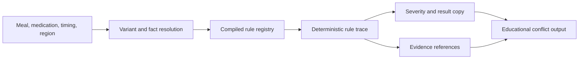

# Rule Engine Overview

ParkinSUM uses deterministic CDSS-style rule execution for educational software
architecture demonstration. The rule layer is designed to be explainable and
reviewable; it is not a substitute for professional medical advice.

## Design Goals

- Keep meal-medication checks deterministic and testable.
- Preserve source and provenance references where available.
- Return explainable output instead of opaque "AI advice."
- Keep optional language-polish layers separate from rule decisions.
- Use synthetic/sample data for public demos.

## Runtime Flow

## Rule Trace

A rule trace should make reviewer questions answerable:

- Which meal, medication, timing, and regional inputs were evaluated?
- Which compiled rule matched?
- Which facts, variants, or fallbacks affected the result?
- Which severity label was assigned?
- Which source references or evidence records were attached?
- Which user-facing explanation was produced?

## Severity Labels

Severity labels are prototype communication labels for educational output. They
must not be framed as clinical triage, diagnosis, treatment urgency, or
individualized medical advice.

Suggested documentation language:

- `low`: informational educational note.
- `moderate`: visible caution for reviewer attention in a demo.
- `high`: stronger prototype warning that still requires professional review
  and must not be treated as emergency or clinical instruction.

## Evidence References

Rules can carry source references and evidence-level metadata. Public docs
should describe this as provenance and reviewability, not as proof of clinical
validation. A future evidence registry should include source family, rule
version, effective dates, review status, and limitations.

## Why Not Black-Box Advice

ParkinSUM avoids black-box medical advice because the public prototype must be
reviewable, conservative, and bounded. Optional AI or copy-polish layers may
make wording easier to read, but they must not create, override, or hide the
deterministic rule result.

## Public Boundary

Use only synthetic or sample data. Do not use the rule engine for real diagnosis,
treatment, medication timing decisions, dietary decisions, patient care,
emergency decisions, or personal health management.
