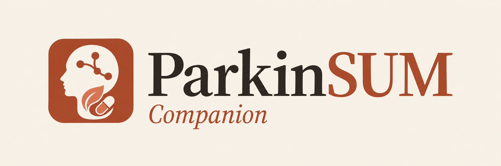
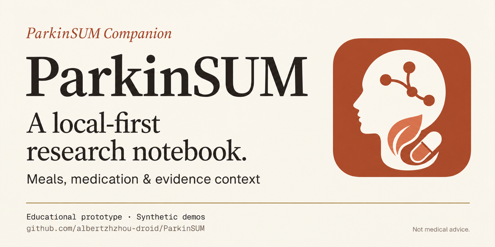

# Warm Paper brand assets

Created 2026-09-29 for the current Paper interface. The original blue/green
assets remain available; the new files use the `-warm` suffix.

| Asset | Export | File |
| --- | --- | --- |
| Icon | 1024 × 1024 PNG | [Download icon](../assets/brand/parkinsum-icon-warm.png) |
| Horizontal logo | 2172 × 724 PNG | [Download logo](../assets/brand/parkinsum-wordmark-warm.png) |
| GitHub card | 1280 × 640 PNG | [Download card](../assets/social-preview/parkinsum-social-preview-warm.png) |





## Shape and color

The mark preserves the original left-facing profile, neural connection, leaf,
and capsule. Simplification reduces the neural motif to three endpoints and
one junction, and uses one leaf and one capsule. These are identity motifs,
not anatomical diagrams or claims about treatment.

Palette targets come directly from `lib/core/theme/paper_theme.dart`:
cream `#F6F1E6`, ink `#2A2420`, terracotta `#A84B2A`, clay `#D97757`, and
muted gilt `#A8874A`. Generated raster colors can vary slightly from the tokens.

## Typography and generation provenance

The typography reference was rendered directly from the app's bundled
`SourceSerif4Display-Medium.ttf`, `SourceSerif4Display-Italic.ttf`, and
`SourceSerif4Display-SemiBold.ttf`, with Geist supporting text. These are the
project's Source Serif 4 4.004 derivatives, internally named Parkin Serif
Display; the declarations and OFL notices are in `pubspec.yaml` and
`assets/fonts/`.

The three artworks were generated using the built-in `image_gen` tool. The
user requested GPT image 2.5, but this tool provides no model selector or
verified underlying version; these files are not represented as verified
GPT image 2.5 output. The image model received both the old icon and an
actual-font specimen, then the new icon was reused as the logo/card reference.
The final PNG lettering is a raster recreation guided by that specimen, not
embedded font text or an exact vector/font outline. The original generated
logo was retained at native resolution; the icon and card were proportionally
resampled for export.

The complete final prompts and input provenance are in
[brand-warm-prompts.json](brand-warm-prompts.json).

## Use

- README uses the new GitHub card; the showcase and guide use the new icon.
- The horizontal logo and icon also exist under `assets/brand/` for later use.
  Flutter catalog references and native launcher assets are unchanged.
- The GitHub card is ready for manual upload to the repository's social-preview
  setting. Creating the local files does not publish them or alter that setting.
- These PNGs have warm opaque backgrounds. They are not transparent or SVG files.
- Retain the educational/synthetic scope in public copy; no user records are used.

## Card copy

```text
ParkinSUM Companion
ParkinSUM
A local-first research notebook.
Meals, medication & evidence context
Educational prototype · Synthetic demos
github.com/albertzhzhou-droid/ParkinSUM
Not medical advice.
```
